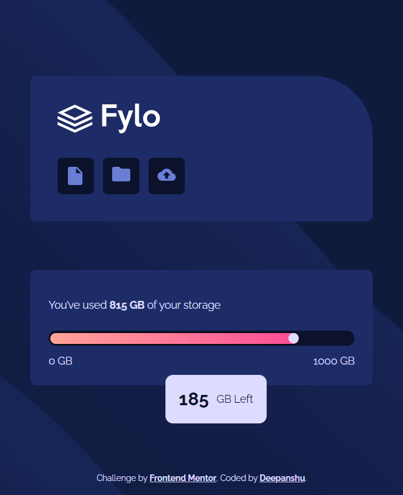

# Fylo Data Storage Component

## Table of Contents

- [Overview](#overview)
  - [The challenge](#the-challenge)
  - [Screenshot](#screenshot)
  - [Links](#links)
- [My process](#my-process)
  - [Built with](#built-with)
  - [What I learned](#what-i-learned)
  - [Continued development](#continued-development)
  - [Useful resources](#useful-resources)
- [Author](#author)
- [Acknowledgments](#acknowledgments)

## Overview

### The challenge

The challenge was to create a responsive data storage component for Fylo. The component includes a navigation bar with icons, a storage usage indicator, and detailed information about the storage used and remaining. The goal was to design a visually appealing and functional component that works seamlessly across different screen sizes.

### Screenshot

### Links

- Solution URL: [GitHub Repository](https://github.com/Deepanshu1337/fylo-data-storage-component-master)
- Live Site URL: [Live Demo](https://deepanshu1337.github.io/fylo-data-storage-component-master/)

## My process

### Built with

- Semantic HTML5 markup
- CSS custom properties
- Flexbox
- CSS Grid
- Mobile-first workflow

### What I learned

Working on this project, I deepened my understanding of CSS Grid and Flexbox for creating responsive layouts. The combination of these technologies allowed me to create a flexible and adaptable component structure. I also learned how to effectively use CSS custom properties for maintaining a consistent design system across the project.

#### Key takeaways:
- Utilizing CSS Grid for complex layout structures.
- Implementing Flexbox for aligning and distributing space within containers.
- Using CSS custom properties to streamline styling and ensure consistency.
- Creating responsive designs that work across various screen sizes.

### Continued development

In future projects, I aim to further explore advanced CSS techniques such as animations and transitions to enhance the interactivity of components. Additionally, I plan to integrate JavaScript to add dynamic behavior and improve user experience.

### Useful resources

- [MDN Web Docs - CSS Grid Layout](https://developer.mozilla.org/en-US/docs/Web/CSS/CSS_Grid_Layout) - This resource helped me understand the basics and advanced concepts of CSS Grid.
## Author

- LinkedIn - [Deepanshu Dixit](https://www.linkedin.com/in/deepanshudixit280/)
- Frontend Mentor - [@Deepanshu1337](https://www.frontendmentor.io/profile/Deepanshu1337)
- GitHub - [Deepanshu1337](https://github.com/Deepanshu1337)

## Acknowledgments

Challenge by [Frontend Mentor](https://www.frontendmentor.io?ref=challenge).
